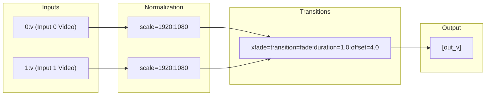

# Architectural & Implementation Plan: Vidonyx Video Composition Engine

Vidonyx is an open-source, production-grade, declarative video composition engine and FFmpeg filtergraph compiler written in idiomatic, modern Go. It empowers developers to define complex multi-track timelines (video, audio, text, transitions, filters, and overlays) using an expressive, type-safe API and compiles them into valid, optimized FFmpeg `-filter_complex` directed acyclic graphs (DAGs).

---

## 1. Core Architectural Pillars & Design Principles

```
┌─────────────────────────────────────────────────────────────┐
│ 1. Declarative AST Layer (Timeline, Tracks, Clips, Effects) │  <-- High-Level Fluent User API
└──────────────────────────────┬──────────────────────────────┘
                               │
                               ▼
┌─────────────────────────────────────────────────────────────┐
│ 2. Semantic Analysis & Normalization Pass                   │  <-- Time alignment, gap filling, format normalization
└──────────────────────────────┬──────────────────────────────┘
                               │
                               ▼
┌─────────────────────────────────────────────────────────────┐
│ 3. Filtergraph IR (Directed Acyclic Graph - DAG)            │  <-- Intermediate Representation: Nodes, Typed Pads, Links
└──────────────────────────────┬──────────────────────────────┘
                               │
                               ▼
┌─────────────────────────────────────────────────────────────┐
│ 4. Graph Optimization & Auto-Routing Passes                 │  <-- Auto-split injection, dead-code elimination, type checking
└──────────────────────────────┬──────────────────────────────┘
                               │
                               ▼
┌─────────────────────────────────────────────────────────────┐
│ 5. Code Generation & Emitters                               │  <-- FFmpeg CLI builder, Mermaid.js / DOT visualizers
└──────────────────────────────┬──────────────────────────────┘
                               │
                               ▼
┌─────────────────────────────────────────────────────────────┐
│ 6. Execution Runtime & Telemetry                            │  <-- Process lifecycle, streaming progress parser, mocks
└──────────────────────────────┬──────────────────────────────┘
```

1. **Compiler Intermediate Representation (IR)**:
   - Avoid ad-hoc string concatenations. Filter chains are represented as a strongly-typed Directed Acyclic Graph (DAG).
   - Independent separation between Timeline semantics (what the user wants) and Filtergraph topology (how FFmpeg connects streams).
2. **Deterministic & Rational Time Model**:
   - Zero floating-point drift across hours of video by utilizing `time.Duration` and a dedicated `types.Rational` (`Num/Den`) time base.
3. **Graph Optimization Passes**:
   - **Auto-Split Injection**: Automatically inserts `split` or `asplit` filters when an output pad is consumed by multiple downstream filters.
   - **Dead-Code Elimination**: Strips unreferenced nodes and dangling pads before generating CLI commands.
   - **Stream Normalization**: Injects `scale`, `pad`, `setsar`, `fps`, and `format=yuv420p` filters to normalize disparate video assets to the target canvas.
   - **Gap Resolution**: Synthesizes transparent color canvases (`color=c=black@0.0`) and silent audio (`anullsrc`) across unpopulated track regions.
4. **Modern Go Standards (Go 1.22+ / 1.23+)**:
   - Native Go iterators (`iter.Seq`, `iter.Seq2`) for zero-allocation sequence traversals.
   - Generics (`[T any]`) for DAG nodes, queue structures, and builder patterns.
   - Structured logging with `log/slog`.
   - Comprehensive error aggregation using `errors.Join`.
   - 100% pure standard library core (no bloated external runtime dependencies).
5. **Observability & Visual Debugging**:
   - Export Filtergraph DAG directly to **Mermaid.js** diagrams and **Graphviz (DOT)** for instant inspection and CI/CD validation.
   - Non-blocking streaming progress tracking parsing FFmpeg's `-progress pipe:1`.

---

## 2. Package Organization & Module Layout

```text
vidonyx/
├── go.mod
├── types/                 # Fundamental mathematical, geometric & temporal types
│   ├── time.go            # Rational time, frame rate conversions, timecode
│   ├── geometry.go        # Point, Size, Rect, Transform, Alignment
│   └── color.go           # RGBA, Hex color parsing and FFmpeg formatters
├── timeline/              # High-level declarative timeline AST & Fluent Builders
│   ├── timeline.go        # Root Timeline definition (Canvas, FPS, Duration, Tracks)
│   ├── track.go           # Track (Video, Audio, Overlay, Subtitle layers)
│   ├── clip.go            # Media slice (Source, Start, Duration, In/Out trims, Speed)
│   ├── transition.go      # Transition specs (XFade, Wipe, Slide, AcrossFade)
│   ├── effect.go          # Visual and audio effect definitions
│   └── validation.go      # Semantic validation using errors.Join
├── filtergraph/           # Graph Intermediate Representation (IR)
│   ├── graph.go           # DAG container, Node/Edge storage, Topological Sort (Kahn's)
│   ├── node.go            # Filter Node representation (filter name, parameters)
│   ├── pad.go             # Typed Input and Output Pads (Video / Audio)
│   ├── pass.go            # Optimizer pass pipeline interface
│   ├── pass_split.go      # Pass: Auto-inject split / asplit nodes
│   ├── pass_dce.go        # Pass: Dead-code elimination
│   └── pass_validate.go   # Pass: Stream type checking and cycle detection
├── compiler/              # Bridge translating Timeline AST -> Filtergraph DAG -> CLI
│   ├── compiler.go        # Main compilation orchestrator
│   ├── planner.go         # Track layer composition, Z-index ordering, gap analysis
│   ├── normalizer.go      # Input stream normalization pipeline
│   ├── emitter_cli.go     # FFmpeg CLI argument builder (-filter_complex, -map, -i)
│   └── emitter_dot.go     # Graphviz DOT & Mermaid.js diagram generation
├── effects/               # Pre-built type-safe filter nodes & transitions
│   ├── video.go           # Scale, Overlay, Crop, Rotate, Pad, DrawText, ChromaKey
│   ├── audio.go           # Volume, Amix, AcrossFade, HighPass, LowPass, Delay
│   └── transitions.go     # XFade transitions (dissolve, wipeleft, fade, zoom)
├── executor/              # Process execution, mocking & telemetry
│   ├── executor.go        # CommandExecutor interface & Process runner
│   ├── mock.go            # MockExecutor for sub-millisecond unit testing
│   ├── progress.go        # Streaming FFmpeg -progress parser & ProgressEvent
│   └── probe.go           # Media metadata inspection interface
├── visualizer/            # Graph rendering utilities (Mermaid & DOT formatters)
│   ├── mermaid.go         # Mermaid.js flowchart renderer
│   └── dot.go             # Graphviz DOT renderer
├── composer/              # Top-level Facade & high-level composition orchestrator
│   └── composer.go        # Fluent entrypoint: composer.New().WithTimeline(...).Render(ctx)
└── examples/              # Real-world recipe examples
    ├── 01_simple_cut/     # Basic cuts & concatenation
    ├── 02_transitions/    # Video cross-fades & audio acrossfades
    ├── 03_picture_in_pic/ # PiP overlay with rounded corners & border
    ├── 04_text_captions/  # Animated captions & watermark overlay
    └── 05_dynamic_audio/  # Multi-track background music ducking
```

---

## 3. Core Component Specifications & Data Contracts

### 3.1. Fundamental Types (`types/`)
- **`types.Rational`**: Exact fractional representation (`Num/Den int64`). Provides exact math (`Add`, `Sub`, `Mul`, `Div`, `Seconds() float64`, `ToDuration() time.Duration`).
- **`types.Size` / `types.Point` / `types.Rect`**: Integer and normalized floating-point coordinate geometries for positioning overlays and video layers.
- **`types.Color`**: Standard RGBA representation with serialization to FFmpeg color strings (e.g. `black@0.0`, `0x1A1A1AFF`).

### 3.2. Declarative Timeline AST (`timeline/`)
- **`Timeline`**: Defines the canvas geometry (`Width`, `Height`), frame rate (`FPS Rational`), background color, and track list.
- **`Track`**: Categorized by `Kind` (`TrackKindVideo`, `TrackKindAudio`, `TrackKindOverlay`, `TrackKindText`) with explicit Z-index layer ordering.
- **`Clip`**: Defines a media element bound to a source URI/path with:
  - `TimelineStart time.Duration` / `Duration time.Duration`
  - `SourceStart time.Duration` (trim start)
  - `Transform` (Position, Scale, Anchor, Opacity, Rotation)
  - `Volume float64` / `Speed float64`
  - `Effects []Effect`
- **`Transition`**: Specifies transitions connecting adjacent clips (e.g. `XFadeTransition{Type: XFadeDissolve, Duration: 500 * time.Millisecond}`).

### 3.3. Filtergraph Intermediate Representation (`filtergraph/`)
- **`Pad`**:
  ```go
  type StreamType uint8
  const (
      StreamTypeVideo StreamType = iota
      StreamTypeAudio
  )

  type Pad struct {
      ID         string
      StreamType StreamType
      Node       *Node
  }
  ```
- **`Node`**:
  ```go
  type Node struct {
      ID         string
      FilterName string
      Params     map[string]any
      Inputs     []*Pad
      Outputs    []*Pad
  }
  ```
- **`Graph`**:
  - Encapsulates nodes and links.
  - Implements Kahn's Algorithm for **Topological Sort** to serialize the execution order.
  - Exposes zero-allocation node and pad iterators (`Nodes() iter.Seq[*Node]`).

### 3.4. Optimization Passes (`filtergraph/pass*.go`)
1. **`ValidatePass`**: Verifies graph acyclicity (cycle detection) and guarantees video pads only link to video inputs, and audio to audio.
2. **`AutoSplitPass`**: Analyzes the fan-out degree of every `OutPad`. If an output pad connects to $N > 1$ input pads:
   - Injects a `split` (for video) or `asplit` (for audio) node with $N$ output pads.
   - Rewires the downstream connections transparently.
3. **`DeadCodeEliminationPass`**: Prunes disconnected subgraphs and orphaned nodes that do not reach designated sink/output pads (`[out_v]`, `[out_a]`).

### 3.5. Compiler & Code Generation (`compiler/`)
- **Input Indexing**: Scans all media sources across clips and generates optimal `-i <path>` entries.
- **Normalization Subgraphs**: Generates canonical pre-processing filter subgraphs per source stream:
  - Video: `[in] scale=w:h:force_original_aspect_ratio=decrease, pad=w:h:(ow-iw)/2:(oh-ih)/2, setsar=1, fps=fps, format=yuv420p [norm_v]`
  - Audio: `[in] aresample=48000, aformat=sample_fmts=fltp:channel_layouts=stereo [norm_a]`
- **Track Compositor**:
  - Successively overlays video layers onto the root background canvas using `overlay` filters with evaluated time intervals `enable='between(t, start, end)'`.
  - Mixes audio streams using `amix` with precise volume envelopes and delays (`adelay`).
- **Emitter**: Serializes the final DAG into the canonical `-filter_complex` string, `-map "[out_v]"`, and `-map "[out_a]"` arguments.

### 3.6. Execution & Progress Runtime (`executor/`)
- **`CommandExecutor` Interface**:
  ```go
  type CommandExecutor interface {
      Run(ctx context.Context, cmd string, args []string, progressHandler func(ProgressEvent)) error
      Inspect(ctx context.Context, cmd string, args []string) (*CommandSummary, error)
  }
  ```
- **`ProgressParser`**: Line-by-line streaming state machine parsing FFmpeg's `-progress pipe:1` key-value pairs (`frame=`, `fps=`, `out_time_us=`, `speed=`, `progress=end`) into structured `ProgressEvent` structs.
- **`MockExecutor`**: Records invocation commands and simulates realistic render progress events for deterministic testing without external dependencies.

---

## 4. Visual Debugging (Mermaid & DOT)

Vidonyx will include built-in visualizers that emit clean diagrams of any generated filtergraph:



---

## 5. Phased Implementation Roadmap

### Phase 1: Foundation, Types & Core Graph IR
- Initialize Go module `github.com/vidonyx/vidonyx`.
- Implement `types/` (Rational time arithmetic, geometries, color representations).
- Implement `filtergraph/` (Node, Pad, Graph, Edge management, Kahn's topological sort).
- Implement Graph passes (`AutoSplitPass`, `DeadCodeEliminationPass`, `ValidatePass`).
- Unit tests & Golden test suite for graph topology and passes.

### Phase 2: Timeline AST & Semantic Model
- Implement `timeline/` (`Timeline`, `Track`, `Clip`, `Transition`, `Effect`).
- Build fluent builder API for constructing timelines.
- Implement multi-error semantic validator (`errors.Join`) checking boundary conditions, overlaps, and track consistency.

### Phase 3: Compiler, Planner & Normalization Engine
- Implement `compiler/planner.go` (timecode layout, Z-index layer stacker, audio mixer).
- Implement `compiler/normalizer.go` (format/resolution/framerate coercion).
- Implement `compiler/emitter_cli.go` (producing full FFmpeg CLI invocation args).
- Implement `visualizer/` (Mermaid.js and Graphviz DOT graph export).

### Phase 4: Effects Library & Standard Filters
- Implement `effects/video.go` (Scale, Overlay, Crop, DrawText, ChromaKey, Blur, Rotate).
- Implement `effects/audio.go` (Volume, Amix, Delay, AcrossFade).
- Implement `effects/transitions.go` (Standard XFade transitions).

### Phase 5: Executor, Progress Telemetry & High-Level Composer Facade
- Implement `executor/progress.go` (FFmpeg `-progress` streaming parser).
- Implement `executor/executor.go` (OS process executor with `context.Context` cancellation).
- Implement `executor/mock.go` (Deterministic mock runner).
- Implement `composer/composer.go` (Unified high-level entrypoint).

### Phase 6: Recipes, Documentation & Quality Assurance
- Add comprehensive examples in `examples/` (Picture-in-Picture, Text Captions, Transitions, Audio Ducking).
- Full test coverage with race detection (`go test -race -v ./...`).
- Fuzz testing for timeline compiler (`go test -fuzz`).
- Complete documentation comments on all exported symbols.

---

## 6. Verification & Testing Strategy

1. **Deterministic Unit Testing**:
   - Every compiler pass and graph mutation is tested using `MockExecutor` and topological graph asserts without needing the `ffmpeg` binary.
2. **Golden File CLI Command Validation**:
   - Complex timelines compiled into FFmpeg CLI arguments compared against golden test files to guard against regressions.
3. **Fuzz Testing (`testing.F`)**:
   - Random timeline configurations (varying clip durations, overlapping intervals, nested effects) fuzzed to ensure no runtime panics or cyclic graphs.
4. **Race Detection**:
   - Run `go test -race ./...` across all packages, particularly in progress streaming and concurrent event dispatching.
