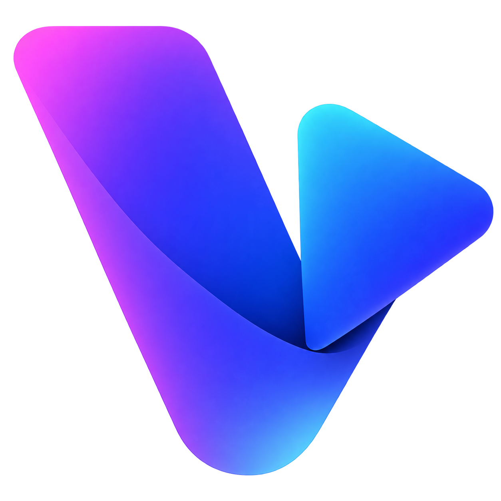
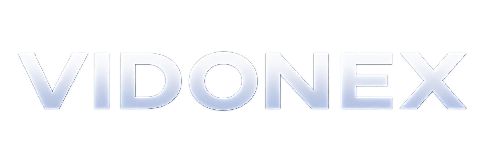
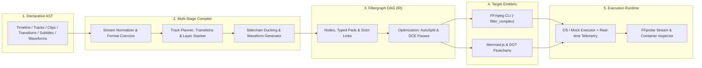

<p align="center">
  
</p>

<h1 align="center">Vidonex</h1>

<p align="center">
  <a href="https://github.com/farshidrezaei/vidonex/actions/workflows/ci.yml"></a>
  <a href="https://github.com/farshidrezaei/vidonex/releases/latest"></a>
  <a href="https://pkg.go.dev/github.com/farshidrezaei/vidonex"></a>
  <a href="https://goreportcard.com/report/github.com/farshidrezaei/vidonex"></a>
  <a href="https://opensource.org/licenses/MIT"></a>
</p>

<p align="center">
  <strong>The Open-Source Non-Linear Video Editor & FFmpeg Filtergraph Compiler Engine</strong><br>
  <em>Cross-Platform Desktop Workstation &bull; Standalone CLI &bull; Pure Go Engine SDK</em>
</p>

<p align="center">
  <a href="#-vidonex-studio-desktop--web-workstation"><strong>Desktop Studio</strong></a> &bull;
  <a href="#-quick-download--installation"><strong>Download</strong></a> &bull;
  <a href="#-vidonex-cli-automation"><strong>CLI Tool</strong></a> &bull;
  <a href="#-vidonex-go-engine-sdk"><strong>Go SDK</strong></a> &bull;
  <a href="#-architecture"><strong>Architecture</strong></a> &bull;
  <a href="#-recipes"><strong>Recipes</strong></a>
</p>

<p align="center">
  
</p>

---

## 🎬 Vidonex Studio (Desktop & Web Workstation)

**Vidonex Studio** is a professional, lightweight non-linear video editing workstation engineered with **Wails v2**, **Nuxt 4**, **Vue 3**, **Nuxt UI**, and **Tailwind CSS**. It delivers the speed and intuitive feel of CapCut and Premiere Pro without Electron bloatware.

### ✨ Studio Highlights

- 🎞️ **Multi-Track Timeline**: Layer video, audio, picture-in-picture overlays, subtitles, and animated waveforms with precise drag-and-drop, trim handles, adjacent clip transitions (XFade ribbons), playhead scrubbing, split clips (`S`), and magnetic snapping.
- 📐 **Interactive Viewport with Transform Gizmo**: Direct on-canvas 8-point resize handles, rotational pivots, magnetic alignment guides, mouse-wheel zoom, and keyboard arrow nudging (`1px` fine / `10px` coarse).
- 🔀 **Customizable Splitter Workspace**: Smooth panel resizing with collapsible drawers for Media Library, Viewport, Timeline, and Inspectors.
- 🎛️ **Full-Suite Inspectors**:
  - **ChromaKey & Despill**: Studio-grade green/blue screen isolation with color pickers and spill suppression.
  - **Sidechain Audio Ducking**: Automatically attenuate background tracks whenever dialogue or voiceover occurs.
  - **Audiogram Waveforms**: Generate synchronized neon waveforms from voice recordings for social media podcasts.
  - **Captions & Subtitles**: Parse and edit SRT/VTT captions with custom fonts, margins, and highlight bounding boxes.
  - **Keyframe Animation**: Animate position, scale, and opacity using smooth mathematical easing curves (Linear, Quad, Cubic, Sine).
  - **DAG Graph Visualizer**: Interactive Mermaid.js visual representation of the underlying FFmpeg filter DAG with SVG export.
- 🚀 **Zero-Copy Native Media Import**: Direct filesystem access with instant FFprobe metadata parsing for multi-gigabyte video libraries.
- ⚡ **Auto Hardware Acceleration**: Automatically detects NVIDIA NVENC, Apple VideoToolbox, Intel QSV, and VAAPI encoders.

---

## 📥 Quick Download & Installation

### Option 1: Native Desktop Executable (Recommended)

Pre-built, standalone binaries are available on the [**GitHub Releases**](https://github.com/farshidrezaei/vidonex/releases/latest) page:

| Platform | Architecture | Binary / Package |
| :--- | :--- | :--- |
| **Linux** | `x86_64` (glibc $\ge$ 2.31) | [`vidonex-linux-amd64`](https://github.com/farshidrezaei/vidonex/releases/latest) |
| **macOS** | Universal (Apple Silicon M1/M2/M3/M4 & Intel) | [`vidonex-darwin-universal`](https://github.com/farshidrezaei/vidonex/releases/latest) |
| **Windows** | `x86_64` (Windows 10/11) | [`vidonex-windows-amd64.exe`](https://github.com/farshidrezaei/vidonex/releases/latest) |

### Option 2: Build Desktop from Source

```bash
# Clone the repository
git clone https://github.com/farshidrezaei/vidonex.git
cd vidonex

# Build and run desktop app (Linux / macOS / Windows)
go build -tags webkit2_41 -o build/bin/vidonex .
./build/bin/vidonex
```

---

## 💻 Vidonex CLI Automation

The **`vidonex`** CLI provides an automation pipeline for server environments, continuous integration, batch rendering, and containerized video workloads.

### CLI Installation

```bash
go install github.com/farshidrezaei/vidonex/cmd/vidonex@latest
```

### Core CLI Commands

```bash
# 1. Start the headless Web Studio & REST/WebSocket server
vidonex serve --port 8080

# 2. Render a declarative YAML or JSON project to MP4
vidonex render project.yaml -o output.mp4 --gpu nvenc

# 3. Dry-run compile and inspect FFmpeg filtergraph args
vidonex render project.yaml --dry-run

# 4. Validate project syntax and media paths
vidonex validate project.yaml

# 5. Export interactive Mermaid or Graphviz DAG diagrams
vidonex graph project.yaml --format mermaid -o filtergraph.mmd

# 6. Probe media streams, codecs, and durations
vidonex probe assets/video.mp4 --json
```

### Declarative Project Specification (`project.yaml`)

```yaml
version: "1.0"
canvas:
  width: 1920
  height: 1080
fps: 60
tracks:
  - id: "background_video"
    kind: "video"
    clips:
      - id: "intro_clip"
        source: "assets/intro.mp4"
        offset: 0s
        duration: 10s

  - id: "pip_overlay"
    kind: "overlay"
    z_index: 1
    clips:
      - id: "webcam"
        source: "assets/webcam.mp4"
        offset: 2s
        duration: 8s
        scale: 0.3
        position: { x: 1300, y: 50 }

  - id: "background_audio"
    kind: "audio"
    clips:
      - id: "soundtrack"
        source: "assets/music.mp3"
        volume: 0.25
```

---

## 🛠️ Vidonex Go Engine SDK

For Go backend developers and video infrastructure engineers, Vidonex is a pure-Go, type-safe compiler that abstracts complex FFmpeg filter strings into a declarative AST and Directed Acyclic Graph (DAG).

### Installation

```bash
go get github.com/farshidrezaei/vidonex
```

### Code Example: Composing Video & Picture-in-Picture

```go
package main

import (
	"context"
	"fmt"
	"log"
	"time"

	"github.com/farshidrezaei/vidonex/composer"
	"github.com/farshidrezaei/vidonex/executor"
	"github.com/farshidrezaei/vidonex/timeline"
	"github.com/farshidrezaei/vidonex/types"
)

func main() {
	// 1. Initialize Timeline Canvas
	tl := timeline.New(
		timeline.WithCanvas(types.Res1080p),
		timeline.WithFPS(types.FPS60),
	)

	// 2. Base Video Layer (Layer 0)
	baseTrack := timeline.NewTrack("main_video", timeline.TrackKindVideo).SetZIndex(0)
	baseTrack.AddClip(
		timeline.NewClip("gameplay", "assets/gameplay.mp4", 0, 15*time.Second),
	)

	// 3. Picture-in-Picture Facecam Layer (Layer 1)
	pipTrack := timeline.NewTrack("pip_overlay", timeline.TrackKindOverlay).SetZIndex(1)
	pipClip := timeline.NewClip("facecam", "assets/webcam.mp4", 2*time.Second, 10*time.Second).
		WithScale(0.25).
		WithPosition(types.Point{X: 1400, Y: 40}).
		WithOpacity(0.95)
	pipTrack.AddClip(pipClip)

	// 4. Background Audio Track
	bgmTrack := timeline.NewTrack("bgm", timeline.TrackKindAudio)
	bgmTrack.AddClip(
		timeline.NewClip("music", "assets/bgm.mp3", 0, 15*time.Second).WithVolume(0.3),
	)

	tl.AddTrack(baseTrack, pipTrack, bgmTrack)

	// 5. Compile and Render
	c := composer.New()

	// Dry-run inspection & Mermaid flowchart
	compilation, err := c.Compile(tl, "output.mp4")
	if err != nil {
		log.Fatalf("Compilation failed: %v", err)
	}

	diagram, _ := compilation.Mermaid()
	fmt.Println("Filtergraph Diagram:\n", diagram)

	// Live progress execution
	ctx := context.Background()
	_, err = c.Render(ctx, tl, "output.mp4", func(event executor.ProgressEvent) {
		fmt.Printf("Progress: %.1f%% (Speed: %.2fx, FPS: %.1f)\n", event.Percentage, event.Speed, event.FPS)
	})
	if err != nil {
		log.Fatalf("Render failed: %v", err)
	}
}
```

---

## 🏗️ Architecture



### Compiler Optimization Passes
- **`AutoSplitPass`**: Automatically injects `split` or `asplit` filters whenever a video/audio pad feeds multiple downstream filters, preventing FFmpeg pad reuse errors.
- **`DeadCodeEliminationPass`**: Prunes dangling nodes, unlinked inputs, and unreachable branches before generating CLI arguments.
- **Alpha Normalization**: Preserves transparency channels (`yuva420p`) across overlays, PNGs, and ChromaKey layers, finishing with optimal `yuv420p` export.
- **Zero-Drift Rational Timing**: Prevents frame desynchronization over long compositions by utilizing exact fractions (`types.Rational`) instead of floating-point numbers.

---

## 📦 Package Layout

| Package | Purpose | Key Symbols |
| :--- | :--- | :--- |
| [`types`](./types/) | Exact math, geometry & colors | `Rational`, `Size`, `Point`, `Rect`, `Color`, `Alignment` |
| [`timeline`](./timeline/) | Declarative timeline AST | `Timeline`, `Track`, `Clip`, `Transition`, `Effect`, `Validate()` |
| [`filtergraph`](./filtergraph/) | Filtergraph DAG intermediate representation | `Graph`, `Node`, `Pad`, `AutoSplitPass`, `DeadCodeEliminationPass` |
| [`compiler`](./compiler/) | AST $\rightarrow$ DAG $\rightarrow$ CLI Compiler | `Compiler`, `CompilationResult`, `BuildFFmpegArgs()` |
| [`animation`](./animation/) | Keyframing & mathematical easing | `PositionTrack`, `FloatKeyframeTrack`, `KenBurnsAnimation`, `Easing` |
| [`subtitles`](./subtitles/) | SRT/VTT parsing & styled caption burn-in | `ParseSRT()`, `ParseVTT()`, `SubtitleTrack`, `AttachSubtitles()` |
| [`ducking`](./ducking/) | Sidechain compression audio ducking | `ApplySidechainDucking()`, `Options`, `DefaultOptions()` |
| [`waveform`](./waveform/) | Animated audio waveform generation | `ApplyWaveformVisualizer()`, `ModePeakToPeak`, `Options` |
| [`chromakey`](./chromakey/) | Green/blue screen removal & despill | `ApplyChromaKey()`, `Options`, `StudioGreenScreen` |
| [`presets`](./presets/) | Social platform presets & GPU acceleration | `TikTokVertical1080p60()`, `YouTube4K60()`, `AcceleratorNVENC` |
| [`effects`](./effects/) | Type-safe reusable filter nodes | `ScaleFilter`, `DrawTextFilter`, `XFadeFilter`, `VolumeFilter` |
| [`probe`](./probe/) | Automated media inspection & stream caching | `MediaProber`, `FFprobeProber`, `CachedProber`, `MockProber` |
| [`executor`](./executor/) | Subprocess execution & live telemetry | `CommandExecutor`, `OSExecutor`, `MockExecutor`, `ParseProgressStream()` |
| [`visualizer`](./visualizer/) | Flowchart generation | `ToMermaid()`, `ToDOT()` |
| [`spec`](./spec/) | Declarative YAML/JSON project parsing | `ParseFile()`, `ParseYAML()`, `ParseJSON()`, `ToTimeline()` |
| [`server`](./server/) | Pure-Go SQLite persistence & WebSocket server | `Server`, `New()`, `Start()`, `Stop()` |
| [`desktop`](./desktop/) | Wails v2 native desktop application bridge | `App`, `NewApp()`, `Startup()`, `SelectFile()` |
| [`ui`](./ui/) | Modern Nuxt 4 + Nuxt UI Web Studio Workstation | Vue 3, Pinia, i18n, Transform Gizmo, Timeline |
| [`composer`](./composer/) | Unified high-level facade | `Composer`, `New()`, `Compile()`, `Render()` |

---

## 🍳 Runnable Recipes

Explore production recipes in [`examples/`](./examples/):

1. **[`01_simple_cut`](./examples/01_simple_cut/)**: Single video trimming and canvas normalization.
2. **[`02_picture_in_picture`](./examples/02_picture_in_picture/)**: Facecam overlay on top of gameplay video.
3. **[`03_transitions`](./examples/03_transitions/)**: Seamless video crossfades (`xfade`) and audio transitions (`acrossfade`).
4. **[`04_animated_motion`](./examples/04_animated_motion/)**: Ken Burns pan/zoom and dynamic 2D position/scale keyframe tracks.
5. **[`05_animated_subtitles`](./examples/05_animated_subtitles/)**: SRT subtitle parsing with styled yellow captions.
6. **[`06_audio_ducking`](./examples/06_audio_ducking/)**: Background soundtrack automatically ducking during voiceover commentary.
7. **[`07_platform_presets`](./examples/07_platform_presets/)**: Vertical 9:16 TikTok 60fps render with NVIDIA NVENC GPU acceleration.
8. **[`08_podcast_audio_waveform`](./examples/08_podcast_audio_waveform/)**: Square 1:1 podcast audiogram with neon animated waveform overlay.
9. **[`09_green_screen_studio`](./examples/09_green_screen_studio/)**: Studio presenter green screen removal with despill filter onto a virtual background.
10. **[`10_declarative_yaml_project`](./examples/10_declarative_yaml_project/)**: Turnkey declarative YAML project with relative media assets and CLI execution.

---

## 🧪 Testing & Quality Assurance

Vidonex adheres to zero-compromise engineering contracts documented in [CONTRACTS.md](CONTRACTS.md).

```bash
# Run all unit and real-FFmpeg end-to-end tests with race detection
go test -race -v ./...

# Run static analysis and linter
golangci-lint run ./...
```

---

## 📄 License

MIT License. See [LICENSE](LICENSE) for details.
