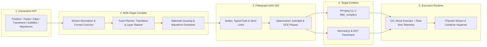

# Vidonex

[](https://github.com/farshidrezaei/vidonex/actions/workflows/ci.yml)
[](https://github.com/farshidrezaei/vidonex/releases)
[](https://pkg.go.dev/github.com/farshidrezaei/vidonex)
[](https://goreportcard.com/report/github.com/farshidrezaei/vidonex)
[](https://opensource.org/licenses/MIT)

**Vidonex** is an open-source, production-grade Go engine & desktop workstation for declarative, non-linear video editing (conceptually similar to Remotion, Editframe, or the CapCut backend, but written natively in idiomatic, high-performance Go).

---

## 🌟 Key Capabilities

- 🎯 **Declarative Timeline Model**: Intuitive, type-safe builder for multi-track video, audio, overlay, waveform, subtitle, and effect layers.
- ⚡ **Filtergraph DAG Compiler**: Compiles high-level timelines into valid, optimized FFmpeg Directed Acyclic Graphs (`-filter_complex`), eliminating brittle string concatenations.
- 🔄 **Graph Optimization Passes**:
  - **Auto-Split Injection (`AutoSplitPass`)**: Automatically inserts `split` or `asplit` filters when an output stream feeds multiple downstream filters.
  - **Dead-Code Elimination (`DeadCodeEliminationPass`)**: Prunes unreferenced nodes and dangling pads before generating CLI commands.
  - **Alpha-Preserving Normalization**: Preserves 100% alpha transparency (`yuva420p`) across overlays, transparent PNGs, and ChromaKey layers, finishing with standard `yuv420p` canvas export.
- ⏱ **Timeline Gap & Offset Synchronization**: Precise Presentation Timestamp (`setpts`) and `adelay` offsetting ensuring non-linear timelines with arbitrary gaps, cuts, and multi-track intervals render with frame-accurate timing.
- 🎨 **Web Studio Workstation (Nuxt 4 + Nuxt UI)**:
  - Interactive multi-track timeline with clip thumbnail filmstrips, waveform previews, and strict native duration boundary enforcement.
  - Viewport Transform Gizmo with magnetic canvas alignment guides and keyboard arrow keys precision nudge (`1px` / `10px`).
  - Searchable Keyboard Shortcuts Cheatsheet and context menus for instant workflow efficiency.
  - Multi-language support (English & Persian) with auto-detecting RTL/LTR typography.
- 📐 **Ken Burns & Dynamic Keyframe Animations**: Mathematical easing curves (Linear, Quad, Cubic, Sine) for dynamic 2D motion paths, scaling, and opacity.
- 💬 **Subtitles & Animated Caption Burn-in**: Parsers for SubRip (`.srt`) and WebVTT (`.vtt`) with TikTok/Reels bounding box styling.
- 🎚 **Smart Audio Ducking**: Sidechain compression automatically lowers background music whenever dialogue or voiceover tracks are active.
- 🌊 **Audio Waveform Visualizer**: Converts audio directly into animated, transparent waveforms (`showwaves`) for podcast audiograms and music visualization.
- 🟢 **Studio Chroma Keying & Despill**: Professional green/blue screen removal with edge feathering and reflected light suppression.
- 🚀 **Platform Presets & GPU Acceleration**: Out-of-the-box configurations for TikTok (9:16 vertical 60fps), YouTube 4K, and GPU acceleration (NVIDIA NVENC, Apple VideoToolbox, Intel QSV).
- 📊 **Visual Debugging**: Built-in export to **Mermaid.js** and **Graphviz (DOT)** diagrams for instant graph visualization.
- ⏱ **Zero-Drift Rational Time**: High-precision fractional time arithmetic (`types.Rational`) preventing floating-point precision drift.
- 🔌 **Pluggable & Mockable Runtime**: `CommandExecutor` and `MediaProber` interfaces for 100% deterministic testing and CI/CD without requiring local binaries.
- 📡 **Embedded Server & Real-Time Telemetry**: Embedded SQLite persistence, RESTful project APIs, and WebSocket streaming progress from FFmpeg's `-progress pipe:1`.

---

## 🏗 Architecture Overview



---

## 📦 Installation

```bash
go get github.com/farshidrezaei/vidonex
```

---

## 🚀 Quickstart: Picture-in-Picture Composition

```go
package main

import (
	"context"
	"fmt"
	"log"
	"time"

	"github.com/farshidrezaei/vidonex/composer"
	"github.com/farshidrezaei/vidonex/executor"
	"github.com/farshidrezaei/vidonex/timeline"
	"github.com/farshidrezaei/vidonex/types"
)

func main() {
	// 1. Define Canvas & Frame Rate
	tl := timeline.New(
		timeline.WithCanvas(types.Res1080p),
		timeline.WithFPS(types.FPS60),
	)

	// 2. Base Video Track (Layer 0)
	baseTrack := timeline.NewTrack("base_video", timeline.TrackKindVideo).SetZIndex(0)
	baseTrack.AddClip(
		timeline.NewClip("gameplay", "assets/gameplay.mp4", 0, 15*time.Second),
	)

	// 3. Picture-in-Picture Facecam Overlay (Layer 1)
	pipTrack := timeline.NewTrack("pip_overlay", timeline.TrackKindOverlay).SetZIndex(1)
	pipClip := timeline.NewClip("facecam", "assets/webcam.mp4", 2*time.Second, 10*time.Second).
		WithScale(0.25).
		WithPosition(types.Point{X: 1400, Y: 40}).
		WithOpacity(0.95)
	pipTrack.AddClip(pipClip)

	// 4. Background Music
	bgmTrack := timeline.NewTrack("bgm", timeline.TrackKindAudio)
	bgmTrack.AddClip(
		timeline.NewClip("music", "assets/bgm.mp3", 0, 15*time.Second).WithVolume(0.3),
	)

	tl.AddTrack(baseTrack, pipTrack, bgmTrack)

	// 5. Compose and Render
	c := composer.New()

	// Dry-run inspection & Mermaid flowchart
	compilation, err := c.Compile(tl, "output.mp4")
	if err != nil {
		log.Fatalf("Compilation failed: %v", err)
	}

	mermaid, _ := compilation.Mermaid()
	fmt.Println("Filtergraph Diagram:\n", mermaid)

	// Execute Render with Live Progress
	ctx := context.Background()
	_, err = c.Render(ctx, tl, "output.mp4", func(event executor.ProgressEvent) {
		fmt.Printf("Rendering: %.1f%% (Speed: %.2fx, FPS: %.1f)\n", event.Percentage, event.Speed, event.FPS)
	})
	if err != nil {
		log.Fatalf("Render failed: %v", err)
	}
}
```

---

## 📚 Package Layout

| Package | Purpose | Key Symbols |
| :--- | :--- | :--- |
| [`types`](./types/) | Exact math, geometry & colors | `Rational`, `Size`, `Point`, `Rect`, `Color`, `Alignment` |
| [`timeline`](./timeline/) | Declarative timeline AST | `Timeline`, `Track`, `Clip`, `Transition`, `Effect`, `Validate()` |
| [`filtergraph`](./filtergraph/) | Filtergraph DAG intermediate representation | `Graph`, `Node`, `Pad`, `AutoSplitPass`, `DeadCodeEliminationPass` |
| [`compiler`](./compiler/) | AST $\rightarrow$ DAG $\rightarrow$ CLI Compiler | `Compiler`, `CompilationResult`, `BuildFFmpegArgs()` |
| [`animation`](./animation/) | Keyframing & mathematical easing | `PositionTrack`, `FloatKeyframeTrack`, `KenBurnsAnimation`, `Easing` |
| [`subtitles`](./subtitles/) | SRT/VTT parsing & styled caption burn-in | `ParseSRT()`, `ParseVTT()`, `SubtitleTrack`, `AttachSubtitles()` |
| [`ducking`](./ducking/) | Sidechain compression audio ducking | `ApplySidechainDucking()`, `Options`, `DefaultOptions()` |
| [`waveform`](./waveform/) | Animated audio waveform generation | `ApplyWaveformVisualizer()`, `ModePeakToPeak`, `Options` |
| [`chromakey`](./chromakey/) | Green/blue screen removal & despill | `ApplyChromaKey()`, `Options`, `StudioGreenScreen` |
| [`presets`](./presets/) | Social platform presets & GPU acceleration | `TikTokVertical1080p60()`, `YouTube4K60()`, `AcceleratorNVENC` |
| [`effects`](./effects/) | Type-safe reusable filter nodes | `ScaleFilter`, `DrawTextFilter`, `XFadeFilter`, `VolumeFilter` |
| [`probe`](./probe/) | Automated media inspection & stream caching | `MediaProber`, `FFprobeProber`, `CachedProber`, `MockProber` |
| [`executor`](./executor/) | Subprocess execution & live telemetry | `CommandExecutor`, `OSExecutor`, `MockExecutor`, `ParseProgressStream()` |
| [`visualizer`](./visualizer/) | Flowchart generation | `ToMermaid()`, `ToDOT()` |
| [`spec`](./spec/) | Declarative YAML/JSON project parsing & relative path resolution | `ParseFile()`, `ParseYAML()`, `ParseJSON()`, `ToTimeline()` |
| [`server`](./server/) | Pure-Go SQLite persistence, REST API, & WebSocket telemetry server | `Server`, `New()`, `Start()`, `Stop()` |
| [`ui`](./ui/) | Modern Nuxt 4 + Nuxt UI Web Studio Workstation (SPA) | Vue 3, Pinia, i18n (FA/EN), Transform Gizmo, Timeline |
| [`composer`](./composer/) | Unified high-level facade | `Composer`, `New()`, `Compile()`, `Render()` |

---

## 🎨 Vidonex Web Studio (GUI)

Vidonex includes a modern, high-performance web workstation built with **Nuxt 4, Vue 3, Nuxt UI v4, Nuxt i18n, TypeScript, and WebSocket**:

- 🎬 **Pro Multi-Track Timeline**: Layer video, audio, overlay, subtitle, and waveform tracks with drag-and-drop, trim handles, adjacent clip transitions (XFade ribbons), sticky time ruler, scrubbing playhead needle, split clip (`S`), duplicate (`Ctrl+D`), and magnetic snapping.
- 📐 **Interactive Viewport with Hand Tool & Zoom**: Direct on-canvas 8-point resize, translation, rotation, smart alignment guides, zoom controls (wheel zoom, fit/reset, preset zoom menu), Spacebar hand pan tool, and full-screen preview.
- 🔀 **Flexible Splitter Layout**: Customizable workspace layout powered by Nuxt UI `USplitter` with collapsible/resizable panels for Media Library, Viewport, Timeline, and Inspector.
- ⏱ **Exact Content Duration & Atomic History**: Timeline and playback durations snap precisely to the last clip boundary without artificial padding, backed by an atomic snapshot-based Undo/Redo engine (`Ctrl+Z` / `Ctrl+Y`).
- 🎛 **Full Feature Inspectors**: Chroma Key, Sidechain Ducking, Podcast Waveform, Caption Subtitle Editor, Ken Burns Keyframes, and interactive Mermaid.js filtergraph DAG visualizer modal with SVG export.
- 💾 **Pure-Go SQLite Persistence**: Auto-saving project workspace with zero CGO dependencies and instant aspect-ratio canvas presets (16:9, 9:16 Reels/TikTok, 1:1 Square, 21:9 Cinema).

### Launching the Web Studio:

```bash
# Start backend server and open Web Studio on http://localhost:8080
vidonex serve --port 8080

# Or run frontend dev mode
cd ui && pnpm dev
```

### 🖥️ Native Desktop Application (Wails v2 + Nuxt 4):

Vidonex includes a native cross-platform desktop workstation powered by Wails v2:
- **Zero Electron Bloat**: Sub-25MB standalone executable utilizing native OS WebViews (Edge WebView2 on Windows, WebKit on macOS, WebKitGTK on Linux).
- **Direct Filesystem Access & Zero-Copy Import**: Instant native file pickers and multi-gigabyte video asset registration directly with local FFprobe metadata.
- **Hardware Acceleration Auto-Detection**: Automatically identifies NVIDIA NVENC, Apple VideoToolbox, Intel QSV, or Linux VAAPI hardware encoders.

```bash
# Build desktop binary (Linux)
go build -tags webkit2_41 -o bin/vidonex-desktop ./cmd/vidonex-desktop

# Launch desktop workstation
./bin/vidonex-desktop
```

---

## 🍳 Example Recipes

Complete, runnable recipes located in [`examples/`](./examples/):

1. **[`01_simple_cut`](./examples/01_simple_cut/)**: Single video trimming and canvas normalization.
2. **[`02_picture_in_picture`](./examples/02_picture_in_picture/)**: Facecam overlay on top of gameplay video with opacity.
3. **[`03_transitions`](./examples/03_transitions/)**: Seamless video crossfades (`xfade`) and audio transitions (`acrossfade`).
4. **[`04_animated_motion`](./examples/04_animated_motion/)**: Ken Burns pan/zoom and dynamic 2D position/scale keyframe tracks.
5. **[`05_animated_subtitles`](./examples/05_animated_subtitles/)**: SRT subtitle parsing with styled yellow captions and bounding boxes.
6. **[`06_audio_ducking`](./examples/06_audio_ducking/)**: Background soundtrack automatically ducking during voiceover commentary.
7. **[`07_platform_presets`](./examples/07_platform_presets/)**: Vertical 9:16 TikTok 60fps render with NVIDIA NVENC GPU acceleration.
8. **[`08_podcast_audio_waveform`](./examples/08_podcast_audio_waveform/)**: Square 1:1 podcast audiogram with neon animated waveform overlay.
9. **[`09_green_screen_studio`](./examples/09_green_screen_studio/)**: Studio presenter green screen removal with despill filter onto a virtual background.
10. **[`10_declarative_yaml_project`](./examples/10_declarative_yaml_project/)**: Turnkey declarative YAML project with relative media assets and CLI execution.

---

## 🧪 Testing & Quality Assurance

Vidonex follows strict engineering contracts enshrined in [CONTRACTS.md](CONTRACTS.md).

```bash
# Run all unit and real-FFmpeg end-to-end tests with race detection
go test -race -v ./...

# Run static analysis and linter
golangci-lint run ./...
```

---

## 📄 License

MIT License. See [LICENSE](LICENSE) for details.
