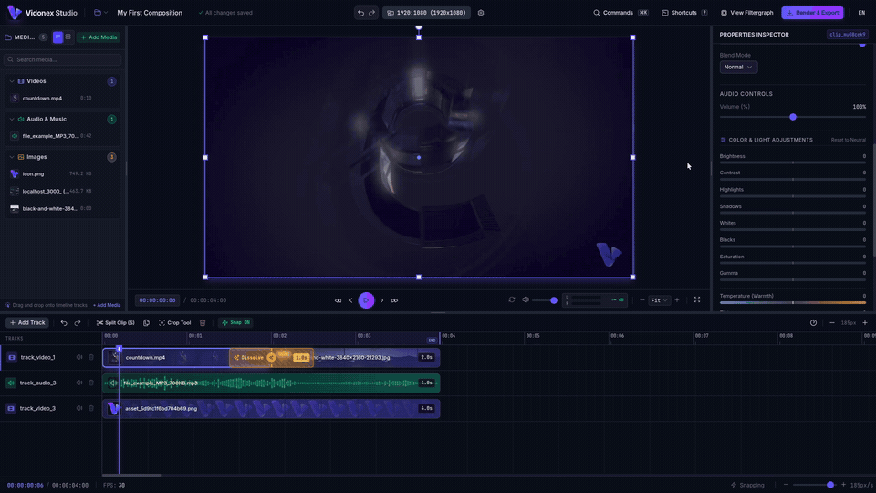

<p align="center">
  <picture>
    <source media="(prefers-color-scheme: dark)" srcset=".github/assets/logo.png">
    
  </picture>
</p>

<h1 align="center">Vidonex</h1>

<p align="center">
  <strong>The Next-Gen Non-Linear Video Editor & FFmpeg Filtergraph Compiler Engine in Go</strong>
</p>

<p align="center">
  <em>High-Performance Go Engine SDK &bull; Cross-Platform Desktop Workstation &bull; Automation CLI &bull; Declarative YAML</em>
</p>

<p align="center">
  <a href="https://github.com/farshidrezaei/vidonex/actions/workflows/ci.yml"></a>
  <a href="https://github.com/farshidrezaei/vidonex/releases/latest"></a>
  <a href="https://pkg.go.dev/github.com/farshidrezaei/vidonex"></a>
  <a href="https://goreportcard.com/report/github.com/farshidrezaei/vidonex"></a>
  <a href="https://farshidrezaei.github.io/vidonex/"></a>
  <a href="https://opensource.org/licenses/MIT"></a>
  <a href="https://github.com/farshidrezaei/vidonex/stargazers"></a>
</p>

<p align="center">
  <a href="https://farshidrezaei.github.io/vidonex/"><strong>📖 Documentation</strong></a> &bull;
  <a href="CHANGELOG.md"><strong>Changelog</strong></a> &bull;
  <a href="#-why-vidonex"><strong>Why Vidonex?</strong></a> &bull;
  <a href="#-quick-start"><strong>Quick Start</strong></a> &bull;
  <a href="#-vidonex-studio"><strong>Studio Workstation</strong></a> &bull;
  <a href="#-go-engine-sdk"><strong>Go SDK</strong></a> &bull;
  <a href="#-cli-automation"><strong>CLI Tool</strong></a> &bull;
  <a href="#-architecture"><strong>Architecture</strong></a> &bull;
  <a href="#-recipes"><strong>Recipes</strong></a>
</p>

<p align="center">
  
</p>

---

## ⚡ What is Vidonex?

**Vidonex** is an open-source, production-grade video composition engine and non-linear video editing workstation engineered natively in **Go** and **Vue 3 / Nuxt UI**.

Historically, programmatic video editing has required writing brittle, 1000-character FFmpeg filter strings or relying on heavy Node.js / Python runtimes (Remotion, MoviePy). Vidonex changes this paradigm: it treats video composition as a **high-level Declarative AST**, compiles it to an **Intermediate Representation Directed Acyclic Graph (DAG)**, executes graph optimization passes (AutoSplit injection, dead-code elimination, format & alpha normalization), and outputs optimal FFmpeg CLI commands with sub-millisecond compile times and native hardware acceleration.

Whether you need a **visual desktop editing suite**, a **cloud video rendering microservice**, or a **CLI batch processing tool**, Vidonex delivers unmatched speed, reliability, and precision.

---

## ⚖️ Why Vidonex? (Comparison)

| Feature | Raw FFmpeg CLI | MoviePy (Python) | Remotion (React/Node) | 🚀 **Vidonex (Go)** |
| :--- | :---: | :---: | :---: | :---: |
| **Language & Runtime** | Bash / Strings | Python (GIL bottleneck) | JavaScript / Puppeteer / Chrome | **Pure Go (Zero-dep Core)** |
| **Compilation Speed** | Manual / N/A | Slow (frame-by-frame) | Moderate (DOM render) | **Sub-millisecond DAG compile** |
| **Visual Desktop GUI** | ❌ No | ❌ No | Web preview | **✅ Native Desktop (Wails + Nuxt UI)** |
| **Memory Footprint** | Low | High (NumPy arrays) | Very High (Headless Chrome) | **Ultra-Low (< 35MB RAM)** |
| **Time Math Safety** | Floats (frame drift) | Floats | Milliseconds | **`types.Rational` Zero-drift Math** |
| **Filter Graph Safety** | Pad mismatch errors | Runtime crashes | React state errors | **Type-Safe DAG & Stream Validation** |
| **Auto-Split Routing** | Manual `[split]` counting | N/A | N/A | **Automated `AutoSplitPass`** |
| **Cloud / Serverless Ready** | Scripting needed | Heavy container | Heavy Docker (~1GB) | **Single static binary (< 25MB)** |
| **Hardware Acceleration** | Manual flags | Limited | Cloud Lambda | **Auto NVENC / VideoToolbox / QSV** |

---

## 🚀 Quick Start

### 1. Install Automation CLI (1-Liner)

**macOS & Linux:**
```bash
curl -fsSL https://raw.githubusercontent.com/farshidrezaei/vidonex/main/install.sh | bash
```

**Windows (PowerShell):**
```powershell
irm https://raw.githubusercontent.com/farshidrezaei/vidonex/main/install.ps1 | iex
```

*(Or via Go toolchain: `go install github.com/farshidrezaei/vidonex/cmd/vidonex@latest`)*

### 2. Download Native Desktop Studio
Standalone production installers for Linux, macOS (Universal), and Windows are available from [**GitHub Releases**](https://github.com/farshidrezaei/vidonex/releases/latest).

### 3. Add to Go Project
```bash
go get github.com/farshidrezaei/vidonex
```

---

## 🎬 Vidonex Studio

Vidonex Studio provides a modern, high-density non-linear video editing workstation built with **Wails v2**, **Nuxt 4**, **Vue 3**, **Nuxt UI**, and **Tailwind CSS** — bringing the tactile responsiveness of CapCut and DaVinci Resolve into a lightweight, native cross-platform app.

### Key Capabilities:
- 🎞️ **Multi-Track Timeline**: Stack video, audio, picture-in-picture overlays, captions, and animated waveforms with drag-and-drop, magnetic snapping, clip splitting (`S`), ripple trims, and crossfade ribbons.
- 📂 **Categorized Media Library**: Fast hierarchical asset browser for Videos, Audio, Images, and Subtitles with live search filtering and direct timeline drop.
- 📐 **Interactive Viewport with Transform Gizmo**: Direct on-canvas 8-point resize handles, rotational pivots, alignment snapping, zoom/pan navigation, and keyboard arrow nudging (`1px` fine / `10px` coarse).
- 🔀 **Flexible Splitter Workspace**: Smoothly collapsible drawers for Media Library, Timeline, Canvas, and Properties Inspectors.
- 🎛️ **Studio-Grade Audio & Video Effects**:
  - **ChromaKey & Despill**: Isolate green/blue screens with fine-tuned similarity, smoothness, and color despill.
  - **Sidechain Audio Ducking**: Dynamically lower background music volume during speech or voiceover.
  - **Animated Audiograms**: Turn voice tracks into pulsing neon waveforms for podcasts and social reels.
  - **Styled Subtitles**: Burn in SRT/VTT captions with custom typography, outlines, and highlight cards.
  - **Easing Keyframes**: Smooth 2D motion tracks powered by Linear, Quad, Cubic, and Sine curves.
  - **Live Filtergraph Inspector**: View and export the real-time Mermaid.js DAG flowchart of your edit.
- ⚡ **Auto GPU Acceleration**: Automatically detects NVIDIA NVENC, Apple VideoToolbox, Intel QSV, or VAAPI with real-time WebSocket progress telemetry.

---

## 🛠️ Go Engine SDK

Compose multi-layered videos programmatically in type-safe Go:

```go
package main

import (
	"context"
	"fmt"
	"log"
	"time"

	"github.com/farshidrezaei/vidonex/composer"
	"github.com/farshidrezaei/vidonex/executor"
	"github.com/farshidrezaei/vidonex/timeline"
	"github.com/farshidrezaei/vidonex/types"
)

func main() {
	// 1. Define 1080p60 Canvas Timeline
	tl := timeline.New(
		timeline.WithCanvas(types.Res1080p),
		timeline.WithFPS(types.FPS60),
	)

	// 2. Base Video Layer (15s Gameplay)
	baseTrack := timeline.NewTrack("main_video", timeline.TrackKindVideo).SetZIndex(0)
	baseTrack.AddClip(
		timeline.NewClip("gameplay", "assets/gameplay.mp4", 0, 15*time.Second),
	)

	// 3. Picture-in-Picture Facecam Layer (Overlay)
	pipTrack := timeline.NewTrack("pip_overlay", timeline.TrackKindOverlay).SetZIndex(1)
	pipClip := timeline.NewClip("facecam", "assets/webcam.mp4", 2*time.Second, 10*time.Second).
		WithScale(0.25).
		WithPosition(types.Point{X: 1400, Y: 40}).
		WithOpacity(0.95)
	pipTrack.AddClip(pipClip)

	// 4. Background Soundtrack with Volume Attenuation
	audioTrack := timeline.NewTrack("bgm", timeline.TrackKindAudio)
	audioTrack.AddClip(
		timeline.NewClip("music", "assets/music.mp3", 0, 15*time.Second).WithVolume(0.3),
	)

	tl.AddTrack(baseTrack, pipTrack, audioTrack)

	// 5. Compile & Render with Live Telemetry
	c := composer.New()
	ctx := context.Background()

	_, err := c.Render(ctx, tl, "output.mp4", func(event executor.ProgressEvent) {
		fmt.Printf("Rendering: %.1f%% (Speed: %.2fx, FPS: %.1f)\n", event.Percentage, event.Speed, event.FPS)
	})
	if err != nil {
		log.Fatalf("Render failed: %v", err)
	}
	fmt.Println("Render complete: output.mp4")
}
```

---

## 💻 CLI Automation & Declarative YAML

Render complex projects in CI/CD pipelines or headless servers using declarative configuration files:

```yaml
version: "1.0"
canvas:
  width: 1080
  height: 1920 # Vertical 9:16 Shorts/Reels
fps: 60
tracks:
  - id: "background"
    kind: "video"
    clips:
      - id: "scenery"
        source: "assets/scenery.mp4"
        offset: 0s
        duration: 15s

  - id: "speaker"
    kind: "overlay"
    z_index: 1
    clips:
      - id: "avatar"
        source: "assets/greenscreen.mp4"
        offset: 1s
        duration: 14s
        chromakey:
          color: "#00FF00"
          similarity: 0.25
          smoothness: 0.1
          despill: true
```

### CLI Commands:
```bash
# Render project with NVIDIA GPU acceleration
vidonex render project.yaml -o reels.mp4 --gpu nvenc

# Inspect compiled FFmpeg filtergraph arguments without rendering
vidonex render project.yaml --dry-run

# Export interactive Mermaid filtergraph diagram
vidonex graph project.yaml --format mermaid -o graph.mmd

# Start headless Studio Web Server & REST API
vidonex serve --port 8080

# Inspect system specs, FFmpeg engine & update status
vidonex about

# Upgrade Vidonex to the latest release
vidonex upgrade
vidonex upgrade --check

# Probe media streams and container metadata
vidonex probe assets/scenery.mp4 --json
```

---

## 🏗️ Architecture

Vidonex uses a modern compiler pipeline inspired by LLVM:

```mermaid
graph LR
    subgraph AST["1. Declarative AST"]
        TL["Timeline Canvas<br/>Tracks & Clips<br/>Transitions & Effects"]
    end

    subgraph Compiler["2. Compiler Engine"]
        Norm["Format Coercion & Normalizer"]
        Stack["Layer Stacker & Alpha Blender"]
        Audio["Audio Ducking & Waveform DSP"]
    end

    subgraph IR["3. Filtergraph DAG (IR)"]
        DAG["Nodes & Typed Stream Pads"]
        Pass1["AutoSplitPass (Branch Isolation)"]
        Pass2["DeadCodeEliminationPass"]
    end

    subgraph Emitter["4. Target Emitters"]
        CLI["FFmpeg -filter_complex CLI"]
        MMD["Mermaid.js Flowchart"]
    end

    subgraph Exec["5. Execution & Telemetry"]
        Runner["Subprocess Stream Pipeline"]
        Progress["Real-time Progress & ETA"]
    end

    TL --> Norm --> Stack --> Audio --> DAG --> Pass1 --> Pass2 --> CLI & MMD --> Runner --> Progress
```



### Core Architecture Highlights:
- **Zero-Drift Time Arithmetic**: Uses `types.Rational` fractions to completely avoid cumulative floating-point timestamp drift across thousands of frames.
- **Automated Pad Split Isolation (`AutoSplitPass`)**: FFmpeg strictly forbids reusing output stream pads. Vidonex statically tracks pad consumer references and automatically injects optimal `split` and `asplit` nodes.
- **Dead Code Elimination (`DeadCodeEliminationPass`)**: Automatically prunes unlinked branches, dormant filters, and unused tracks before emitting the filtergraph string.
- **Format Normalization & Alpha Preservation**: Ensures alpha transparency channels (`yuva420p`) are preserved through overlays and chroma keys, ending with standard `yuv420p` encoding for universal player compatibility.

---

## 📦 Package Directory

| Package | Description | Key APIs |
| :--- | :--- | :--- |
| [`types`](./types/) | Exact math, geometry & colors | `Rational`, `Size`, `Point`, `Rect`, `Color`, `Alignment` |
| [`timeline`](./timeline/) | Declarative timeline AST | `Timeline`, `Track`, `Clip`, `Transition`, `Effect`, `Validate()` |
| [`filtergraph`](./filtergraph/) | Directed Acyclic Graph intermediate representation | `Graph`, `Node`, `Pad`, `AutoSplitPass`, `DeadCodeEliminationPass` |
| [`compiler`](./compiler/) | AST $\rightarrow$ DAG $\rightarrow$ CLI Compiler | `Compiler`, `CompilationResult`, `BuildFFmpegArgs()` |
| [`animation`](./animation/) | Keyframing & easing curves | `PositionTrack`, `FloatKeyframeTrack`, `KenBurnsAnimation`, `Easing` |
| [`subtitles`](./subtitles/) | SRT/VTT parsing & styled caption burn-in | `ParseSRT()`, `ParseVTT()`, `SubtitleTrack`, `AttachSubtitles()` |
| [`ducking`](./ducking/) | Sidechain compression audio ducking | `ApplySidechainDucking()`, `Options`, `DefaultOptions()` |
| [`waveform`](./waveform/) | Animated audio waveform visualizers | `ApplyWaveformVisualizer()`, `ModePeakToPeak`, `Options` |
| [`chromakey`](./chromakey/) | Green/blue screen removal & despill | `ApplyChromaKey()`, `Options`, `StudioGreenScreen` |
| [`presets`](./presets/) | Platform presets & GPU encoders | `TikTokVertical1080p60()`, `YouTube4K60()`, `AcceleratorNVENC` |
| [`effects`](./effects/) | Pre-built type-safe filter nodes | `ScaleFilter`, `DrawTextFilter`, `XFadeFilter`, `VolumeFilter` |
| [`probe`](./probe/) | Automated media inspection & stream caching | `MediaProber`, `FFprobeProber`, `CachedProber`, `MockProber` |
| [`executor`](./executor/) | Subprocess execution & live telemetry | `CommandExecutor`, `OSExecutor`, `MockExecutor`, `ParseProgressStream()` |
| [`visualizer`](./visualizer/) | Flowchart visualization | `ToMermaid()`, `ToDOT()` |
| [`spec`](./spec/) | Declarative YAML/JSON project parsing | `ParseFile()`, `ParseYAML()`, `ParseJSON()`, `ToTimeline()` |
| [`server`](./server/) | Pure-Go SQLite persistence & WebSocket server | `Server`, `New()`, `Start()`, `Stop()` |
| [`desktop`](./desktop/) | Wails v2 native desktop application bridge | `App`, `NewApp()`, `Startup()`, `SelectFile()` |
| [`ui`](./ui/) | Modern Nuxt 4 + Nuxt UI Web Studio Workstation | Vue 3, Pinia, i18n, Transform Gizmo, Multi-Track Timeline |
| [`composer`](./composer/) | Unified high-level facade | `Composer`, `New()`, `Compile()`, `Render()` |

---

## 🍳 Runnable Recipes

Explore production recipes in [`examples/`](./examples/):

- [`01_simple_cut`](./examples/01_simple_cut/): Trimming, canvas resizing, and normalization.
- [`02_picture_in_picture`](./examples/02_picture_in_picture/): Facecam PiP overlay with opacity and custom positioning.
- [`03_transitions`](./examples/03_transitions/): Seamless video crossfade (`xfade`) and audio transitions (`acrossfade`).
- [`04_animated_motion`](./examples/04_animated_motion/): Ken Burns pan/zoom and dynamic 2D position/scale keyframe tracks.
- [`05_animated_subtitles`](./examples/05_animated_subtitles/): Styled SRT subtitles with custom typography and borders.
- [`06_audio_ducking`](./examples/06_audio_ducking/): Sidechain compression ducking music under spoken voiceover.
- [`07_platform_presets`](./examples/07_platform_presets/): 9:16 Vertical TikTok export with NVIDIA NVENC acceleration.
- [`08_podcast_audio_waveform`](./examples/08_podcast_audio_waveform/): 1:1 Audiogram video with reactive neon waveform visualizer.
- [`09_green_screen_studio`](./examples/09_green_screen_studio/): ChromaKey green screen removal with despill onto virtual studio backdrop.
- [`10_declarative_yaml_project`](./examples/10_declarative_yaml_project/): Turnkey YAML project executed via the CLI.

---

## 🧪 Quality & Tests

Vidonex adheres to zero-compromise engineering contracts documented in [CONTRACTS.md](CONTRACTS.md).

```bash
# Run unit tests with race detection
go test -race -v ./...

# Run real-FFmpeg end-to-end integration tests
go test -race -v ./tests/e2e/...

# Run static analysis and linting
golangci-lint run ./...
```

---

## 🤝 Contributing

Contributions are warmly welcome! Please review our [Contributing Guide](CONTRIBUTING.md) and [Code of Conduct](CODE_OF_CONDUCT.md) before opening a pull request.

---

## 📄 License

Vidonex is open-source software licensed under the [MIT License](LICENSE).
