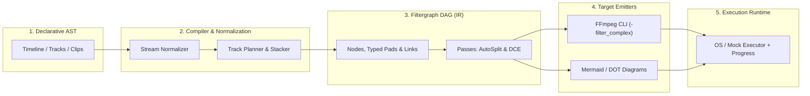

# Vidonyx

[](https://pkg.go.dev/github.com/farshidrezaei/vidonyx)
[](https://goreportcard.com/report/github.com/farshidrezaei/vidonyx)
[](https://opensource.org/licenses/MIT)

**Vidonyx** is an open-source, production-grade Go library and engine for declarative, non-linear video editing (NLE composition engine, conceptually similar to Remotion, Editframe, or the CapCut backend, but written natively in idiomatic Go).

---

## Key Features

- 🎯 **Declarative Timeline Model**: Intuitive, type-safe builder for multi-track video, audio, overlay, and text layers.
- ⚡ **Filtergraph DAG Compiler**: Compiles timelines into valid, optimized FFmpeg Directed Acyclic Graphs (`-filter_complex`), eliminating brittle string concatenations.
- 🔄 **Automatic Optimization Passes**:
  - **Auto-Split Injection**: Automatically inserts `split` or `asplit` filters when an output stream feeds multiple downstream filters.
  - **Dead-Code Elimination (DCE)**: Prunes unreferenced nodes and dangling pads before generating CLI commands.
  - **Normalization**: Auto-injects resolution, aspect ratio (SAR=1), frame rate (FPS), and pixel format (`yuv420p`) coercions.
- 📊 **Visual Debugging**: Built-in export to **Mermaid.js** and **Graphviz (DOT)** diagrams for instant graph visualization.
- ⏱ **Zero-Drift Rational Time**: High-precision fractional time arithmetic (`types.Rational`) avoiding floating-point precision drift.
- 🔌 **Pluggable & Mockable Runtime**: `CommandExecutor` interface allows 100% deterministic unit testing and CI/CD runs without requiring FFmpeg binaries.
- 📡 **Real-time Telemetry**: Streaming progress parsing from FFmpeg's `-progress pipe:1`.
- 🚀 **Zero External Runtime Dependencies**: Built purely on the Go standard library.

---

## Architecture Overview



---

## Installation

```bash
go get github.com/farshidrezaei/vidonyx
```

---

## Quickstart

### Picture-in-Picture Video Composition

```go
package main

import (
	"context"
	"fmt"
	"log"
	"time"

	"github.com/farshidrezaei/vidonyx/composer"
	"github.com/farshidrezaei/vidonyx/executor"
	"github.com/farshidrezaei/vidonyx/timeline"
	"github.com/farshidrezaei/vidonyx/types"
)

func main() {
	// 1. Define Canvas & Frame Rate
	tl := timeline.New(
		timeline.WithCanvas(types.Res1080p),
		timeline.WithFPS(types.FPS60),
	)

	// 2. Base Video Track (Layer 0)
	baseTrack := timeline.NewTrack("base_video", timeline.TrackKindVideo).SetZIndex(0)
	baseTrack.AddClip(
		timeline.NewClip("gameplay", "assets/gameplay.mp4", 0, 15*time.Second),
	)

	// 3. Picture-in-Picture Facecam Overlay (Layer 1)
	pipTrack := timeline.NewTrack("pip_overlay", timeline.TrackKindOverlay).SetZIndex(1)
	pipClip := timeline.NewClip("facecam", "assets/webcam.mp4", 2*time.Second, 10*time.Second).
		WithScale(0.25).
		WithPosition(types.Point{X: 1400, Y: 40}).
		WithOpacity(0.95)
	pipTrack.AddClip(pipClip)

	// 4. Background Music
	bgmTrack := timeline.NewTrack("bgm", timeline.TrackKindAudio)
	bgmTrack.AddClip(
		timeline.NewClip("music", "assets/bgm.mp3", 0, 15*time.Second).WithVolume(0.3),
	)

	tl.AddTrack(baseTrack, pipTrack, bgmTrack)

	// 5. Compose and Render
	c := composer.New()

	// Dry-run inspection
	compilation, err := c.Compile(tl, "output.mp4")
	if err != nil {
		log.Fatalf("Compilation failed: %v", err)
	}

	mermaid, _ := compilation.Mermaid()
	fmt.Println("Filtergraph Diagram:\n", mermaid)

	// Execute Render with Live Progress
	ctx := context.Background()
	_, err = c.Render(ctx, tl, "output.mp4", func(ev executor.ProgressEvent) {
		fmt.Printf("Rendering: %.1f%% (Speed: %.2fx, FPS: %.1f)\n", ev.Percentage, ev.Speed, ev.FPS)
	})
	if err != nil {
		log.Fatalf("Render failed: %v", err)
	}
}
```

---

## Package Organization

- [`types`](./types/): Exact Rational time arithmetic, frame rate definitions, geometry, and color models.
- [`timeline`](./timeline/): High-level declarative timeline, track, clip, transition, and effect AST.
- [`filtergraph`](./filtergraph/): Generic FFmpeg Filtergraph IR (DAG), topological sort (Kahn's algorithm), and optimization passes (AutoSplit, DeadCodeElimination).
- [`compiler`](./compiler/): Translates Timeline AST $\rightarrow$ Filtergraph DAG $\rightarrow$ valid FFmpeg CLI arguments.
- [`effects`](./effects/): Type-safe filter abstractions (`Scale`, `Overlay`, `DrawText`, `ChromaKey`, `Volume`, `AcrossFade`, `XFade`).
- [`visualizer`](./visualizer/): Mermaid.js and Graphviz DOT diagram generators.
- [`executor`](./executor/): Subprocess execution with context cancellation, real-time `-progress` stream parser, and `MockExecutor`.
- [`composer`](./composer/): Unified facade uniting composition, compilation, inspection, and rendering.

---

## Testing & Quality

Run the complete test suite with the Go race detector:

```bash
go test -race -v ./...
```

---

## License

MIT License. See [LICENSE](LICENSE) for details.
