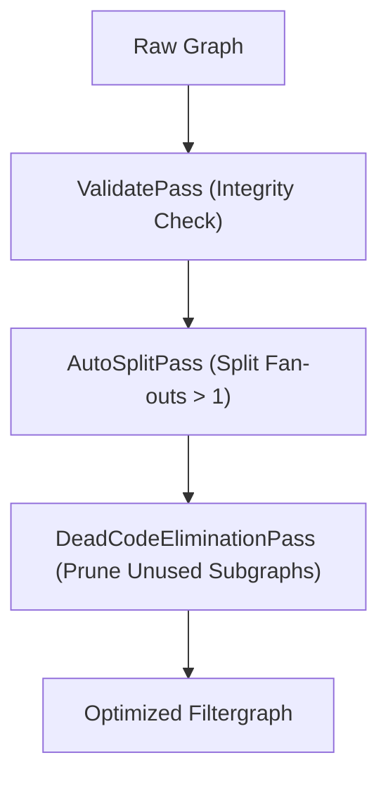

# Filtergraph Intermediate Representation (IR) & Passes

This document explains the design, data structures, and graph rewrite algorithms of the **Vidonyx Filtergraph IR**.

---

## 1. Graph Model & Topology

The Filtergraph IR represents an FFmpeg filter network as a typed Directed Acyclic Graph (DAG):

```text
  [Input Pad] ──────► (Node: Filter) ──────► [Output Pad]
                            │
                            ▼
               Params: map[string]any
```

- **`Node`**: Represents a discrete filter (e.g. `scale`, `pad`, `overlay`, `split`, `amix`, `xfade`).
- **`Pad`**: Represents an input terminal (`IsInput=true`) or output terminal (`IsInput=false`) with an associated `StreamType` (`StreamTypeVideo` or `StreamTypeAudio`).
- **`Edge`**: A directed link between an `OutPad` and an `InPad`.

---

## 2. Invariants & Safety

1. **Acyclicity**: Graph links that would introduce cycles are immediately rejected during `g.Connect(srcOut, dstIn)` via DFS traversal.
2. **Stream Type Matching**: Video pads cannot connect to audio inputs. Type checking is enforced on link creation and verified again during `ValidatePass`.
3. **Single Consumer Invariant**: FFmpeg filters can only consume an output pad once. Multi-consumer fan-out is automatically resolved by the `AutoSplitPass`.

---

## 3. Topological Sort (Kahn's Algorithm)

To render the DAG into a valid FFmpeg `-filter_complex` string, nodes must be serialized in dependency order:

1. Compute in-degrees (number of predecessor nodes feeding into each node).
2. Seed a FIFO queue with all nodes having in-degree = 0 (source nodes).
3. Dequeue a node, append to the ordered result, and decrement the in-degrees of all downstream successor nodes.
4. If a successor node's in-degree drops to 0, enqueue it.
5. If the total number of sorted nodes does not match the total node count, a cycle is detected and `ErrCycleDetected` is returned.

---

## 4. Graph Rewrite Passes



### AutoSplitPass
- Scans all output pads for fan-out degree $N > 1$.
- Injects a `split` (video) or `asplit` (audio) node with $N$ fresh output pads (`v_split_out_1`, `v_split_out_2`, ...).
- Reconnects downstream consumer input pads to the split outputs.

### DeadCodeEliminationPass
- Identifies designated graph sinks (e.g. `[out_v]`, `[out_a]`).
- Performs a backward depth-first search (DFS) marking all reachable predecessor nodes as active.
- Unmarked nodes and their disconnected edges are pruned from the graph.
