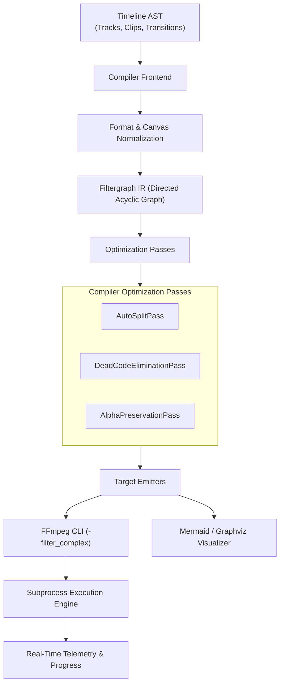

# Architecture & Compiler Pipeline

Vidonex uses a modern compiler pipeline inspired by compiler theory. Instead of generating text directly from the timeline, it translates high-level intents into a strongly-typed graph intermediate representation (IR).

---

## 1. Declarative AST (`timeline/`)

The Timeline AST represents the user's compositional intent. It contains:
- **Canvas & Frame Rate**: Dimensions (`1920x1080`), Framerate (`60/1 fps`), Background color.
- **Tracks**: Video, Audio, Overlay, Subtitle, or Waveform tracks.
- **Clips**: Media sources, source trim ranges, canvas position, scale, rotation, opacity, and volume.
- **Transitions**: Crossfades (`xfade`), dissolves, slides, and wipes between adjacent clips.

---

## 2. Filtergraph IR (`filtergraph/`)

The intermediate representation is an explicit Directed Acyclic Graph (DAG):
- **Nodes**: FFmpeg filter instances (`scale`, `overlay`, `amix`, `sidechaincompress`, `colorkey`).
- **Pads**: Input and output stream endpoints tagged with strict stream types (`StreamTypeVideo` or `StreamTypeAudio`).
- **Links**: Unambiguous directed edges connecting exactly one output pad to one input pad.

---

## 3. Compiler Passes

Before emitting the FFmpeg string, Vidonex runs graph optimization passes:

### `AutoSplitPass`
In FFmpeg, an output pad can be consumed by at most one downstream filter. If two filters consume pad `[v1]`, FFmpeg throws an error. The `AutoSplitPass`:
1. Traverses the graph and counts consumers for each output pad.
2. If consumers > 1, it transparently injects a `split` (video) or `asplit` (audio) filter.
3. Automatically rewires downstream input pads to the newly created split output pads.

### `DeadCodeEliminationPass` (DCE)
Prunes dangling nodes, unlinked pads, and dead branches that do not contribute to final audio or video outputs, optimizing render memory and startup times.

### Alpha Channel Normalization
Ensures transparency channels (`yuva420p`) are preserved through complex overlay stacks, ChromaKey operations, and animated graphics, concluding with standard `yuv420p` for maximum hardware player compatibility.

---

## 4. Zero-Drift Rational Timing (`types.Rational`)

Floating-point numbers (`float64`) accumulate rounding errors when calculating frame indices over thousands of frames. Vidonex represents all frame intervals, timebases, and speeds using exact fractions:

$$\text{Time} = \frac{\text{Numerator}}{\text{Denominator}}$$

This guarantees frame-accurate video synchronization regardless of duration.
